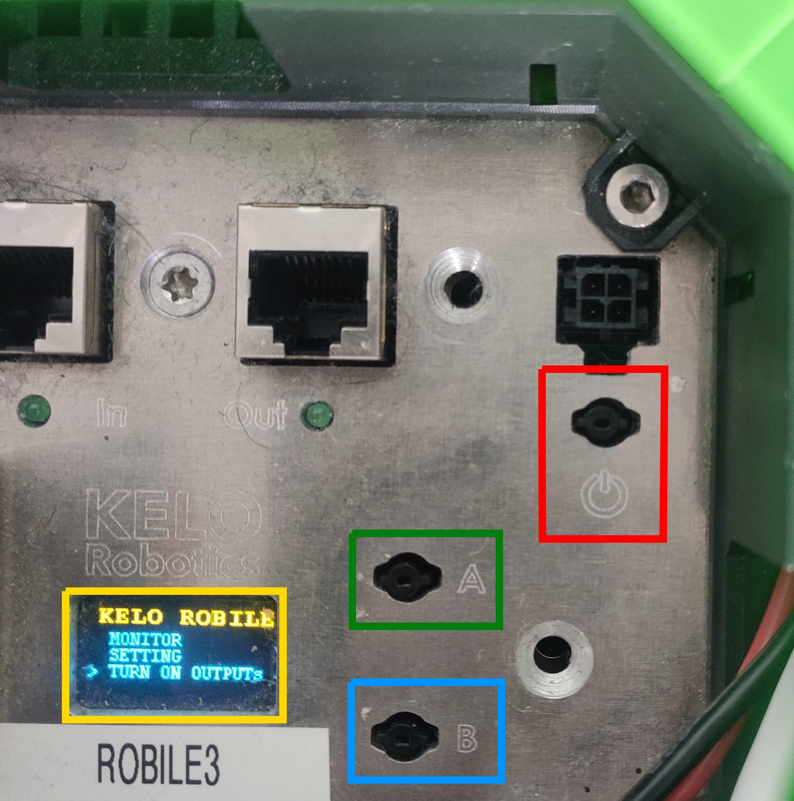

.. _robile_switch_on:

Switching-on the Robot
======================

The Robile can be switched on by long pressing the power button (in red colored box) on the robot until the LED lights are lighted. 
Now the Robile bricks are supplied with power. To start the CPU, scroll to the **TURN ON OUTPUTs** option by using the button B (in blue colored box) 
and select it by pressing the button A (in green colored box), which sometimes requires long press. 
The robot is now ready to be used.

|
To switch off the robot, select the **SWITCH OFF OUTPUTs** option. 
To completely switch off the power supply to the robot, long press the power button on the robot.

.. note::
    The battery percentage can be checked by selecting the **MONITOR** option.